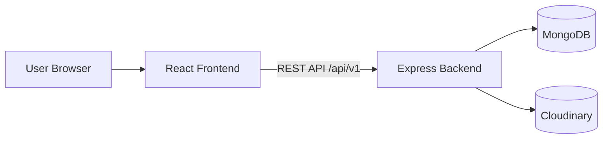
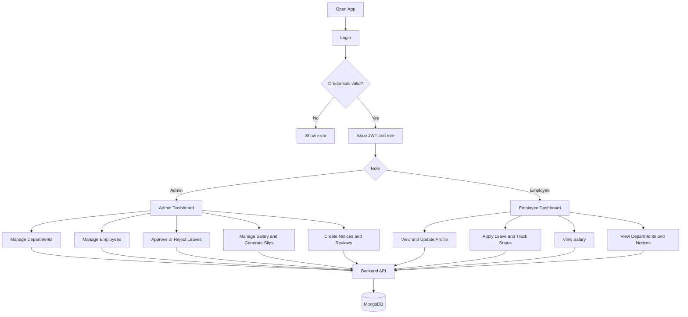

# ManagePro

ManagePro is a full-stack Employee Management System for handling employee operations in one place: users, departments, leaves, salary, notices, and performance reviews.

## 1. Project Overview

### System Description
ManagePro provides role-based dashboards for Admin and Employee users. It centralizes daily HR workflows so teams can reduce spreadsheet-based tracking and manual coordination.

### Core Problems Solved
- Disconnected employee and department records
- Manual leave request and approval processes
- Difficulty maintaining salary history and slip generation
- Lack of centralized notice and review management

### Target Users
- Admin: manages operations, approvals, salaries, notices, and reviews
- Employee: views profile, applies leave, checks salary, and reads notices/departments

### System Goals
- Secure role-based access
- Reliable and maintainable API design
- Scalable modular architecture

---

## 2. Technology Stack

| Layer | Technology | Purpose |
| :--- | :--- | :--- |
| Frontend | React + Vite | SPA UI and development tooling |
| Frontend | React Router DOM | Role-based page routing |
| Frontend | Tailwind CSS | UI styling |
| Frontend | Axios | API communication |
| Backend | Node.js + Express | REST API and business logic |
| Database | MongoDB + Mongoose | Data storage and schema modeling |
| Auth | JWT + bcrypt | Authentication and password hashing |
| Media | Multer + Cloudinary | File handling and cloud asset storage |
| Docs/PDF | PDFKit | Salary slip generation |

---

## 3. System Architecture

### High-Level Diagram



### Architecture Notes
- Frontend uses role-protected routes to control page access.
- Backend applies JWT verification and admin role middleware for protected operations.
- Data is persisted in MongoDB.
- Media and generated files are uploaded to Cloudinary.

---

## 4. User Flow Diagram



---

## 5. Core Features

### Admin Features
- Dashboard summary with key operational metrics
- Department creation and listing
- Employee management (add, view, update, delete)
- Leave request review and status updates
- Salary management and salary slip generation
- Notice creation and review management

### Employee Features
- Personal dashboard
- Profile update flow
- Leave request submission and status view
- Salary visibility
- Department cards with popup details
- Notice board visibility

---

## 6. Authentication and Authorization

- Login endpoint returns JWT access token.
- Frontend stores token and includes it as Authorization Bearer token.
- Backend middleware verifies token before protected route access.
- Admin-only endpoints are guarded by role middleware.
- Frontend route guards prevent unauthorized page navigation.

---

## 7. Backend API Modules

Base URL:

http://localhost:8000/api/v1

Available modules:
- /auth
- /user
- /department
- /employee
- /salary
- /leave
- /review
- /notice

Common endpoints:
- POST /auth/login
- GET /auth/verify
- GET /department
- POST /department/add (admin)
- GET /employee/all (admin)
- POST /leave
- PATCH /leave/:leaveId (admin)
- GET /salary/employee

---

## 8. Project Structure

```text
Project/
	Readme.md
	React-Backend/
		package.json
		userSeed.js
		src/
			app.js
			index.js
			controllers/
			db/
			middlewares/
			models/
			routes/
			utils/

	React-Frontend/
		package.json
		vite.config.js
		src/
			App.jsx
			components/
			context/
			pages/
```

---

## 9. Getting Started

### Prerequisites
- Node.js 18+
- npm
- MongoDB

### Install Dependencies

Backend:

```bash
cd React-Backend
npm install
```

Frontend:

```bash
cd React-Frontend
npm install
```

### Run Project

Backend:

```bash
cd React-Backend
npm run dev
```

Frontend:

```bash
cd React-Frontend
npm run dev
```

Frontend URL:

http://localhost:5173

### Optional Seed

```bash
cd React-Backend
npm run seed
```

---

## 10. Scripts

### Backend
- npm run dev
- npm run start
- npm run seed

### Frontend
- npm run dev
- npm run build
- npm run preview
- npm run lint

---

## 11. Deployment Notes

- Set production CORS origin to your deployed frontend domain.
- Ensure all required backend environment variables are configured in your hosting platform.
- Verify MongoDB and Cloudinary connectivity in production.

---

## 12. Troubleshooting

- Login redirect issues:
	- Check route path consistency in frontend links and route definitions.
	- Verify token exists and auth verify endpoint returns success.

- API request failures:
	- Confirm backend is running on port 8000.
	- Verify frontend proxy setup for /api.

- Upload failures:
	- Validate Cloudinary configuration values.

- DB connection issues:
	- Validate MongoDB URL and server availability.

---

ManagePro is structured for clear separation of concerns, secure role handling, and easy future scaling.
